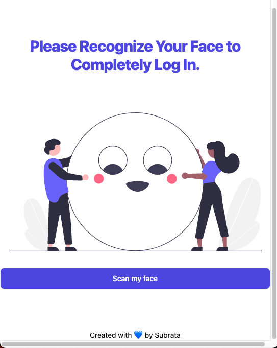
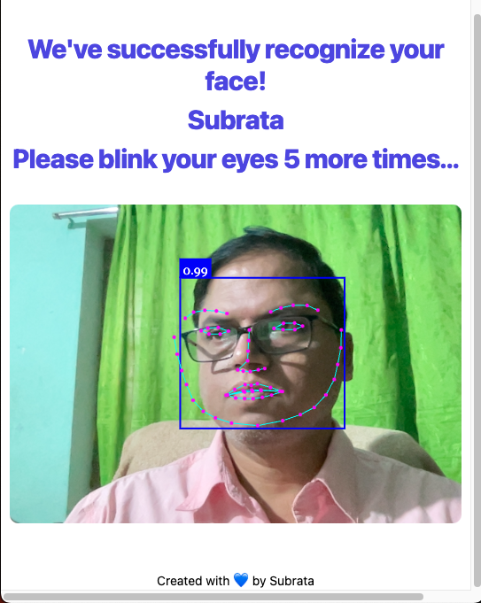

# Face Recognition Authentication System

> A secure facial recognition authentication application with anti-spoofing liveness detection, built with React and face-api.js.

A working prototype that demonstrates how to build a face-based login system that requires users to perform real-time actions (like blinking or smiling) to prevent photo-based bypass attacks. Everything runs in the browser using **open-source models** — no server required, no face data leaves your device.

## 🔴 The Problem with Regular Face Login

A basic face recognition system can be fooled by a printed photo or a video played on a screen. If someone holds up a photo of the registered user, the system sees a face, matches it, and grants access. This is called a **spoofing attack**.

The solution? A **liveness check** — asking the user to perform a real-time action that a static photo or pre-recorded video cannot replicate. Examples:

- ✅ Blink twice
- ✅ Smile
- ✅ Turn your head left/right  
- ✅ Open your mouth

This prototype demonstrates exactly how to build this.

## 🎯 Live Demo

You can find a live demo of the application [here](https://subraatakumar.github.io/face-recognition-authentication-system-prototype/).

## 📸 Screenshots

<!-- Container for the images -->
<div style="display: flex; flex-wrap: wrap; gap: 16px;">

  <!-- Image 1 -->
  <div style="flex: 1 calc(33.333% - 16px); box-sizing: border-box;">
    
  </div>

  <!-- Image 2 -->
  <div style="flex: 1 calc(33.333% - 16px); box-sizing: border-box;">
    
  </div>

  <!-- Image 3 -->
  <div style="flex: 1 calc(33.333% - 16px); box-sizing: border-box;">
    
  </div>
  
  <!-- Image 4 -->
  <div style="flex: 1 calc(33.333% - 16px); box-sizing: border-box;">
    
  </div>
  
  <!-- Image 5 -->
  <div style="flex: 1 calc(33.333% - 16px); box-sizing: border-box;">
    
  </div>

</div>

## ✨ Features

- **Facial Recognition** — Uses face-api.js to detect and recognize faces in real-time
- **Multi-User Support** — Register and authenticate multiple users
- **Client-Side Processing** — All face recognition happens in the browser; no data sent to servers
- **Secure Authentication** — Foundation for implementing liveness checks to prevent spoofing attacks
- **Real-Time Video Stream** — Live webcam feed with instant face detection and recognition
- **Responsive UI** — Clean, modern interface built with React and TailwindCSS

## 🧠 How It Works

### Step 1: Registration
1. User allows camera access
2. App detects their face in the video stream
3. Generates a **face descriptor** — a unique 128-number array (mathematical fingerprint of the face)
4. Saves this descriptor locally (in browser localStorage)

### Step 2: Login
1. Webcam opens again
2. A new face descriptor is generated from the live video feed
3. App compares the new descriptor against all saved descriptors using **Euclidean distance**
4. If the distance is small enough (typically < 0.6), it's a match → User is authenticated

### Step 3: Anti-Spoofing (Liveness Check)
Before or after recognition, the system can challenge the user:
1. App requests a random action: "Please blink twice" or "Please smile"
2. Watches **facial landmarks** (68 key points on the face) in real-time
3. Detects if eyes actually closed (blink) or mouth opened (smile)
4. Only approves login if the challenge is passed

A printed photo cannot blink. A video could theoretically be replayed, but randomized challenges make this impractical.

## 🧬 The Models Behind the Magic

`face-api.js` uses pre-trained neural networks (built on TensorFlow.js) to process face data:

| Model | Size | Purpose |
|-------|------|---------|
| **Tiny Face Detector** | ~190 KB | Fast face detection on live video streams. Optimized for real-time performance on mobile. |
| **SSD MobileNet V1** | ~5.4 MB | High-accuracy detector in this repo (4.0 MB + 1.4 MB shards, plus manifest). |
| **Face Landmark 68 Net** | ~350 KB | Detects 68 key points on the face (eyes, nose, mouth, jaw). Essential for liveness detection. |
| **Face Recognition Net** | ~350 KB | Generates the 128-number face descriptor for identity matching. |
| **Face Expression Net** | ~600 KB | Detects emotions (happiness, sadness, anger, surprise). Useful for smile-based challenges. |
| **Age & Gender Net** | ~380 KB | Estimates age and gender (for demographics or additional context). |

Models are stored as `.json` (architecture) + `.bin` files (weights), split into ~4 MB chunks for parallel browser download.

## 📋 Prerequisites

- **Node.js** v16+ and npm v8+
- **Modern browser** with Webcam support (Chrome, Firefox, Safari, Edge)
- **Secure context** (HTTPS or localhost) — browsers require HTTPS for webcam access
- **Camera permissions** — users must grant permission to access their webcam

## 🚀 Installation

### 1. Clone the repository:

```bash
git clone https://github.com/subraatakumar/face-recognition-authentication-system-prototype.git
cd face-recognition-authentication-system-prototype
```

### 2. Install dependencies:

```bash
npm install
```

### 3. Start the development server:

```bash
npm run dev
```

The application will open at [http://127.0.0.1:5173/](http://127.0.0.1:5173/).

### 4. Build for production:

```bash
npm run build
```

Output is in the `dist/` directory.

### 5. Deploy to GitHub Pages:

```bash
npm run deploy
```

## 📁 Project Structure

```
src/
├── main.jsx              # Vite entry point
├── index.css             # Global styles
├── App.jsx               # Root component
├── router.jsx            # React Router configuration
├── components/
│   ├── Footer.jsx        # Footer component
│   └── User.jsx          # User management component
├── pages/
│   ├── Layout.jsx        # Main layout wrapper
│   ├── Home.jsx          # Home/welcome page
│   ├── Login.jsx         # Login page with face recognition
│   ├── Protected.jsx     # Protected route (post-login)
│   └── UserSelect.jsx    # User selection before login
└── assets/
    └── images/           # Application images

public/
├── models/               # Pre-trained face-api.js models
│   ├── tiny_face_detector_model-*.bin
│   ├── face_landmark_68_model-*.bin
│   ├── face_recognition_model-*.bin
│   └── ... (other model files)
└── temp-accounts/        # Temporary user data storage (browser localStorage)
```

## 🔍 Understanding Blink Detection (Core Anti-Spoofing)

The **Eye Aspect Ratio (EAR)** is a mathematical formula that detects blinks by analyzing facial landmarks:

```
       |p2 - p6| + |p3 - p5|
EAR = ─────────────────────────
            2 * |p1 - p4|
```

- When eyes are **open**, EAR ≈ 0.3
- When eyes are **closed** (blink), EAR ≈ 0.0

By monitoring EAR frame-by-frame from the video stream, the system reliably detects blinks in real-time. A liveness check waits for blink count ≥ 2 within a time window (e.g., 5 seconds).

## 🛡️ Security Considerations

- **Client-Side Processing**: All face data processing happens locally in the browser. Face images are never stored or transmitted to a server.
- **Face Descriptors**: The system only saves 128-number arrays (mathematical fingerprints), not actual photos.
- **Liveness Verification**: Randomized challenges (blink, smile, head turn) prevent replay attacks and photo/video spoofing.
- **Production Deployment**: 
  - Always use HTTPS (browsers require it for webcam access)
  - Implement server-side verification of liveness checks
  - Encrypt stored face descriptors in a database
  - Add rate limiting to prevent brute-force attempts
  - Use signed tokens to prevent client-side tampering

## 🌍 Real-World Use Cases

- **Corporate Attendance** — Touchless check-in systems verifying employees are physically present
- **Two-Factor Authentication** — Replacing SMS codes with face + liveness check
- **KYC (Know Your Customer)** — Identity verification for fintech and banking apps
- **Exam Proctoring** — Ensuring the registered test-taker is the same person taking the exam
- **Accessibility** — Hands-free navigation for users with motor disabilities

## 🧪 Testing & Troubleshooting

### Camera Not Detected?
- Ensure HTTPS is enabled (or using localhost)
- Check browser permissions for webcam access
- Try a different browser
- Verify your webcam works in other applications

### Face Not Being Recognized?
- Ensure adequate lighting
- Position face within the frame
- Remove sunglasses or heavy makeup if used during registration
- Get closer to the camera
- Try adjusting the distance threshold (default: 0.6)

### Model Loading Slow?
- First load caches models in browser localStorage — subsequent loads are faster
- Check internet connection
- Try a different browser (Chrome typically loads fastest)

## 📚 Learn More

For in-depth explanation of how this works, including implementation details and advanced concepts, read the full blog post:
👉 [How to Build a Liveness-Check Login with face-api.js and React](https://subraatakumar.com/blog/how-to-build-a-liveness-check-login-with-face-api-js-and-react/)

## 🛠️ Technologies Used

- **React 18** — UI library
- **React Router DOM** — Client-side routing
- **face-api.js** — Face detection, recognition, and liveness detection
- **TensorFlow.js** — Neural network runtime (used by face-api.js)
- **Tailwind CSS** — Utility-first CSS framework
- **Headless UI** — Unstyled accessible components
- **Vite** — Modern build tool and dev server

## 🚀 Next Steps / Enhancements

1. **Randomized Liveness Challenges** — Instead of always blinking, randomly pick from: blink, smile, turn left, turn right
2. **Backend Integration** — Connect to Node.js + MongoDB/PostgreSQL to persist user descriptors across sessions
3. **Fallback Authentication** — Add password login as a backup in case camera fails
4. **Mobile App** — Use `@tensorflow/tfjs-react-native` to bring this to React Native apps
5. **Edge Case Testing** — Test with glasses, different lighting, hats, and adjust thresholds accordingly
6. **Advanced Spoofing Detection** — Detect printed photos, replayed videos, or deepfakes
7. **Multi-Factor Authentication** — Combine face login with other authentication methods

## 🤝 Contributing

Contributions are welcome! If you find bugs, have suggestions, or want to improve the application:

1. Fork the repository
2. Create a feature branch (`git checkout -b feature/amazing-feature`)
3. Commit your changes (`git commit -m 'Add amazing feature'`)
4. Push to the branch (`git push origin feature/amazing-feature`)
5. Open a Pull Request

Please ensure your code follows the existing style and includes appropriate comments.

## 📄 License

This project is licensed under the **MIT License** — see the [LICENSE](./LICENSE) file for details.

## 🙏 Acknowledgments

- **face-api.js** — Built on [face-api.js](https://github.com/justadudewhohacks/face-api.js/) by Vincent Mühler
- **TensorFlow.js** — Powered by [TensorFlow.js](https://www.tensorflow.org/js)
- Original prototype by [Subrata Kumar Das](https://subraatakumar.com/)

---

**Built with React, face-api.js, and TailwindCSS. All processing happens on your device — no face data is sent anywhere.** 🚀
